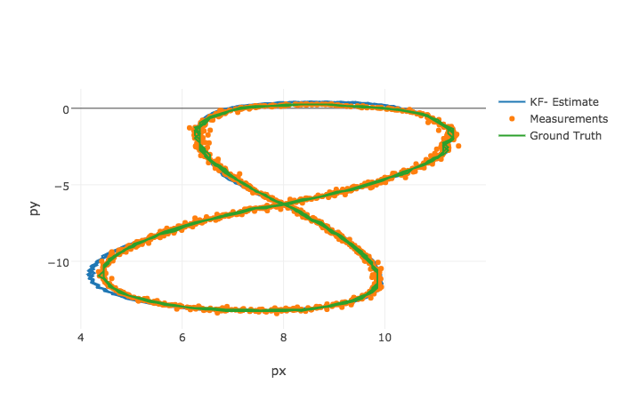

# Self-Driving Car Engineer Nanodegree
# Robotics: Sensor Fusion
## Project: Extended Kalman Filter (EKF)

---

### Overview
This is the 6th project of the <a href="https://www.udacity.com/course/self-driving-car-engineer-nanodegree--nd013">Self Driving Car Engineer Nanodegree</a> I am taking part.  
The aim of this project was to build a EKF (Extended Kalman Filter) in order to track the movement (here, a pedestrian) from both Radar and Lidar data.

### Results
This is an output of the result I was able to obtain: 

As the legend say, the green green line represents the real movement of the pedestrian, while based on the measurement (orange dots), the blue line represents what the EKF has been able to reproduce. 

### How the EKF has been here implemented
The following flow-chart has been used to implement the EKF:

The 3 major steps are  
  * <b>1. Initialize the matrices</b>  
  We will fed the algorithm with the first measurement, and the corresponding uncertainty for the initial start. This will only happen at the beginning, since once the algorithm is "launched", we will use the computed error of the next estimate as input. 

  * <b>2. Predict the state</b>  
  We then predict the new state based on the previous estimate and the measured value (input data).

  * <b>3. Update the state</b>  
  The state is updated and a new error estimate is computed. This new error is then fed to step 1). 

---

## Dependencies

* cmake >= 3.5
 * All OSes: [click here for installation instructions](https://cmake.org/install/)
* make >= 4.1
  * Linux: make is installed by default on most Linux distros
  * Mac: [install Xcode command line tools to get make](https://developer.apple.com/xcode/features/)
  * Windows: [Click here for installation instructions](http://gnuwin32.sourceforge.net/packages/make.htm)
* gcc/g++ >= 5.4
  * Linux: gcc / g++ is installed by default on most Linux distros
  * Mac: same deal as make - [install Xcode command line tools]((https://developer.apple.com/xcode/features/)
  * Windows: recommend using [MinGW](http://www.mingw.org/)

## Basic Build Instructions

1. Clone this repo.
2. Make a build directory: `mkdir build && cd build`
3. Compile: `cmake .. && make`
4. Run it: `./ExtendedKF path/to/input.txt path/to/output.txt`. You can find
   some sample inputs in 'data/'.
    - eg. `./ExtendedKF ../data/sample-laser-radar-measurement-data-1.txt output.txt`
